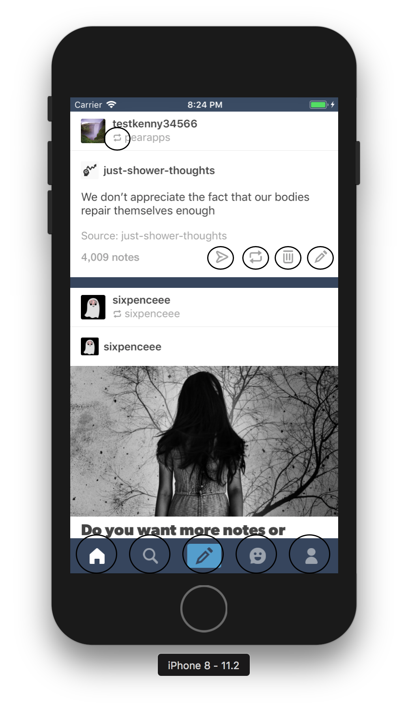

# Improving Application Startup Time


## Ken Ackerson


^ I am a staff engineer at tumblr,
- building new features
- building developer tools
- building frameworks for developers (networking and UI)
- and most recently a big focus on application startup performance

---

# Table of Contents

- Introduction / Backstory
- Problems and solutions 
- General performance tips 

^ Most of the things I am going to talk about today are things we have done to improve our applications launch time 

---

# Backstory

## 2016
- Tumblr application started in approx. 12-15 seconds
- No production performance metrics

^ We were unclear how slow the application actually was. 

^ We had some very high level ideas about what was wrong.

--- 

# Why it matters

- 86% of consumers have deleted applications because of performance issues.
	- *[Source](https://www.appdynamics.com/media/uploaded-files/1425406960/app-attention-span-research-report-1.pdf)*
- Users hate to wait

^ Study after study conclude that performance is a key aspect of driving user engagement and retention AND revenue.
Checkout that source for even more data around this impact as well
Apple is focusing on performance in iOS 12 as a key part of the 

---

> App to slow! One Star!!
-- App Store Review

^ Not actual, but we did see a lot of these!

---

# Measuring

- Always measure
	- Always in `Release` mode
- You can add something like this:

```swift
static func measure(function: () -> ()) {
    let time = CFAbsoluteTimeGetCurrent()
    function()
    let t2 = CFAbsoluteTimeGetCurrent()
    print("Time taken \(t2 - time)")
}

// Callsite
measure {
	// Some expensive work
}

```

^ Measure in release mode
Add this quick and dirty measure function 

---

# Instruments

- File Activity
- System Usage
- Time Profiler
- Network

^ These are the main instruments
We use these to check out what our app is doing and finding performance issues
Not going to go to much into these but will cover the System Usage instrument later

---

# Pre-main 

- Before `UIApplication` callbacks
- View metrics with the `DYLD_PRINT_STATISTICS` env variable

^ So before willFinishLaunching 

---


---

# `DYLD_PRINT_STATISTICS`

```
Total pre-main time: 2.3 seconds (100.0%)
         dylib loading time: 397.16 milliseconds (16.8%)
        rebase/binding time: 1.0 seconds (43.9%)
            ObjC setup time: 354.35 milliseconds (15.0%)
           initializer time: 566.47 milliseconds (24.0%)
           slowest intializers :
               libSystem.dylib :   9.16 milliseconds (0.3%)
                 MediaServices : 343.37 milliseconds (14.5%)
                  RevealServer : 135.42 milliseconds (5.7%)

```

---

# Parts of pre-main

- dylib loading time
- rebase/binding time
- ObjC setup time
- initializer time


--- 

# dylib loading time

- Loading of dynamic libraries
	- Apple recommends only 6 non-Apple dynamic libraries 

^ The first and one of the main problems we had was this dylib loading time; we had upwards of 66 dynamic frameworks in 2015-2016

---

# Fixing dynamic linking times at Tumblr - a history

**2015-2016**

66 third party (non-Apple) dynamic frameworks

**2017**

Mixed static libraries and dynamic frameworks

**2018**

Almost exclusively static libraries where possible 

--- 

# Switch to static libraries

- Cocoapods 1.5.x
	- Supports static linking for Swift
	- Turn off `use_frameworks!`
- Hybrid solutions if needed

^ For a year or so before Cocoapods 1.5.x - we have had a hybrid solution where many of our Objective-C libraries that were only linked with our main application. 
Bottom line is that the more dynamic libraries you remove or convert to static libraries - the faster your application will launch for cold starts


---

# Results


--- 

# Rebase/binding time and ObjC setup time

- This is the time it takes to setup all of your Objective-C classes and selectors

- Remove unused Objective-C code
- Use Swift

^ At Tumblr we write almost all new code in swift - Swift structs tend to be faster and there is less to do with Swift code at startup, generally

---

# Post-main


^ Everything after our `UIApplication` callbacks 
This is where things start to be more about how we are writing our code and what we are doing.
Most applications have a couple things in common: 
Donwloading JSON and displaying it, so post-main I am going to focus on that use case

---

# Third party libraries

- Be careful about adding third party libraries


^ Not only can they be doing things for you in pre main (Increasing objc setup time and initialization time and potentially adding dynamic frameworks - since they have, they can add tons of network calls and blocking I/O calls during startup. 
Not only this, many third party analytics and social SDKs have timers that wake up your application during runtime and do expensive work. This is bad for user experience for likely a little gain for you. 


---

# Asset loading

- We found issues with `UIImage(named: "")`
	- Costs between 15-50+ ms depending on device per image
- Similar issues with UIFont - especially bundled fonts.

^ `UIImage(named:` can use  - also with UIFont
There is a shared cache internally to apple that is extremely expensive for the first call for any given image name string (not just i/o)

---



^ 150-500 ms - Half a second just in the first screen - just to display a couple  


--- 

# `UIImage(named: "")` solution 1


```swift

struct BackgroundResourceLoader {
    static func loadImages() {
        DispatchQueue.global(qos: .utility).async {
            let _ = UIImage.heart
        }
    }
}

...

    func application(_ application: UIApplication,
     willFinishLaunchingWithOptions launchOptions: [UIApplicationLaunchOptionsKey : Any]? = nil) -> Bool {
	     
		// Load resources in the beginning of this method
        BackgroundResourceLoader.loadImages()
        
...

```

^ We noticed that during application launch we had spare threads that were idling during application launch, so we can add a lot of work that previously had to happen serially on the main queue to background threads, and to be executed in parallel. This allows us to take full advantage of all the cores of an iPhone on launch instead of loading everything serially on the main thread.
However you need to be careful - if your application doesnt already generate threads and you add this; you might end up allocating a bunch of extra threads; however in our case (and for my side projects) this has worked out as one of the best techniques to improve post main launch time.

---

# `UIImage(named: "")` solution 2


```
extension UIImage {
    static func directoryForHeartResource() -> String? {
        return Bundle.main.path(forResource: "heart", ofType: "png")
    }
    
    static let heart = UIImage(named: directoryForHeartResource() ?? "")
}

// Callsite
let heartImageView = UIImageView()
heartImageView.image = UIImage.heart

```

^Pros of first solution is that you don't have to change all your callsites
And you avoid I/O 100% on the main thread (but again - I/O isn't the main problem here)

Pros of the second solution is that you maintain your own cache which is a lot more efficient but doesn't necessarily free the images in the case of memory warnings 

You can also use a hybrid solution (do the second one but also load it originally on the background queue

___

### Other use cases

- `UIFont` 
- CoreData `NSMangedObjectModel` allocations
- Other I/O blocking application startup

^ Other use cases for this technique - again; you really want to measure to be sure.

--- 

^ Show I/O Instrument


---


^ The I/O instrument is the best way to find out what exactly your app is reading/writing from disk at any time - but especially startup. Deferring the load of these things and/or doing them in parallel to needed work 

---

# Optimizing View Controllers


^ As you can probably tell, the tumblr Application is a tab view controller based application. 
When we started digging into what we were actually doing during startup, allocating all the view controllers for each tab was taking up a lotttt of startup time.
We realized two of the view controllers were doing a bunch of its data loading (from disk and network) on initialization. We moved most of our setup to `viewDidLoad` and a lot of the computation moved to when you tap on the actual tab
If you still measure a performance issue just for allocating the VC and its internal logic - you can do something like this:


---

# Lazily load VCs with VC containment

```swift
final class MyViewControllerLazyContainer: UIViewController {
    private var viewController: MyViewController?
   
    override func viewDidLoad() {
        super.viewDidLoad()
        loadViewControllerIfNeeded()
    }

    private func loadViewControllerIfNeeded() {
        guard viewController == nil else {
            return
        }

        let vc = // Create expensive `MyViewController`

        addChildViewController(vc)
        view.addSubview(vc.view)

        viewController = vc
    }
}
```

^ This will move allocation and view loading to when the user taps the tab bar icon.
Uses VC containment

---

# General performance tips

---

# Concurrent Programming using GCD groups

```swift
        let group = DispatchGroup()
        let queue = DispatchQueue(label: "com.kenny", qos: .default, attributes: .concurrent, autoreleaseFrequency: .inherit, target: nil)
        
        func expensiveWork() {
            // Expensive work
        }
        
        func moreExpensiveWork() {
            // More expensive work
        }
        
        // We can pass the function directly because of first class functions in Swift
        queue.async(group: group, execute: expensiveWork)
        queue.async(group: group, execute: moreExpensiveWork)

        group.notify(queue: DispatchQueue.global(qos: .utility)) {
            // Work is done! Use the work that was done in `expensiveWork` and `moreExpensiveWork`
        }
```

^ Use GCD Groups to:
- Split single task into multiple parts (think GIF decoding)
- Dont use `wait` because it blocks the whole thread

---

# Compiler settings we've enabled

- WMO (Whole Module Optimization) 
- LTO (Link time Optimization)


^ Whole Module Optimization - There are multiple kinds of optimizations that this allows the compiler to do - the main being `Generic Specialization` which can make specialized versions of generic function calls. But this also allows other things such as function inlining and the removal of dead code.
Link Time Optimization - similar - allows compiler to do similar optimizations to C based languages - inlines commonly called functions and can strip unused code intermodule 

---

# Other compiler settings to investigate

- Unroll loops
- Repeated use of `weak` references

^ These are probably microoptimizations unless you have a really large codebase 
Unrolling loops is a common micro-optimization that is useful for some applications (but we found the tumblr application doesn't have enough of the kind of loops that this can unroll for it to make a difference)
Repeated use of `weak` references is something that I have turned on in some of my side projects - this causes a warning if you necessarily 


---

#TL/DR

- Profile, Profile, Profile!
- Use less dynamic libraries
- Use Swift and/or remove dead Objective-C code
- Measure and optimize assets and UIViewController initializations during launch
- Make sure your project settings are optimal for what tradeoffs you want

---

# More Resources

- [Optimizing App Startup Time - WWDC 2016](https://developer.apple.com/videos/play/wwdc2016/406/)
- [App Startup Time: Past, Present, and Future - WWD 2017](https://developer.apple.com/videos/play/wwdc2017/413/)
- [iOS App Launch time analysis and optimizations](https://medium.com/@avijeet.dutta13/ios-app-launch-time-analysis-and-optimization-a219ee81447c)
- [Optimizing Facebook for iOS start time](https://code.facebook.com/posts/1675399786008080/optimizing-facebook-for-ios-start-time/)

---

# Special thanks

Paul Rehkugler
Ken Kresminski
Micheal Benedict
Brian Michel
Jimmy Schementi

---

# Thats all

[twitter.com/pearapps](twitter.com/pearapps)

[stepsapp.co](http://stepsapp.co)
[developear.com](developear.com)

pearapps@gmail.com

[https://github.com/Pearapps/AppStartupPerformanceTalk](https://github.com/Pearapps/AppStartupPerformanceTalk)

----

